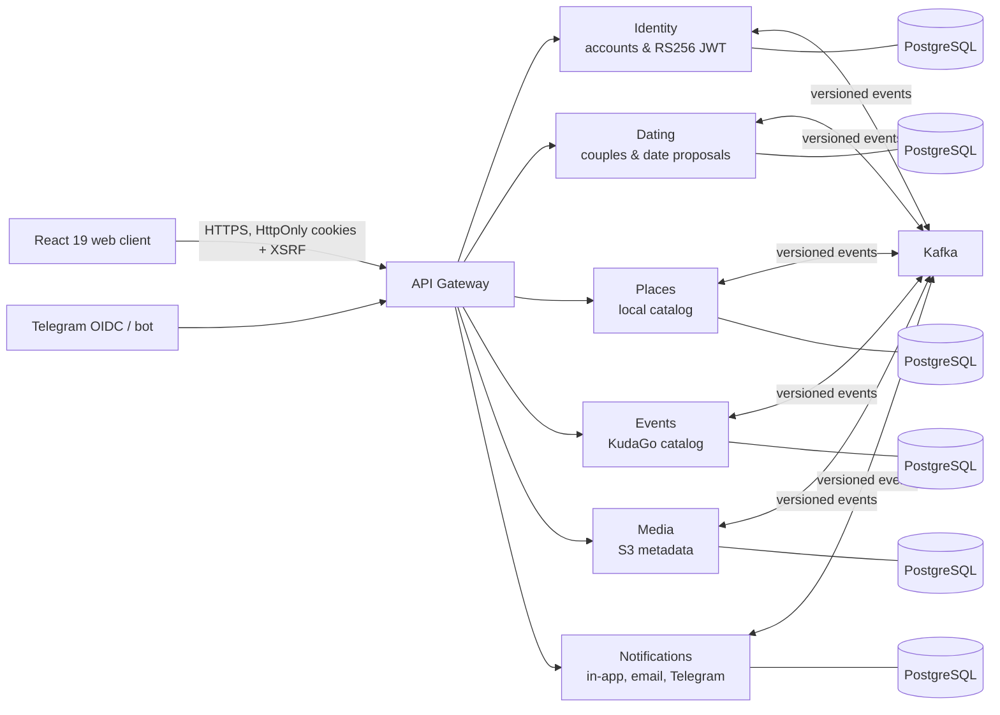

# Owoke

[](https://github.com/owokequ/dating/actions/workflows/ci.yml)
[](https://openjdk.org/projects/jdk/21/)
[](https://spring.io/projects/spring-boot)
[](https://react.dev/)

**Owoke** is a production-oriented dating planner: users form a couple, discover
local places and events, propose a date and coordinate the decision in the web
application or Telegram. It is a regular website, not a Telegram Mini App;
Telegram provides optional OIDC login and notifications.

The project is deliberately designed around the problems that a CRUD demo usually
skips: secure browser sessions, reliable asynchronous delivery, independent data
ownership, idempotent commands, observable deployment and recovery from partial
failure.

## Why this project is interesting

- **Reliable event-driven flow.** Seven independently deployable Spring Boot
  services publish versioned Kafka contracts. Transactional outbox, consumer
  inbox and retry/DLT handling make duplicate delivery and temporary failures
  explicit design cases rather than happy-path assumptions.
- **Security as an end-to-end boundary.** Identity signs RS256 JWTs and exposes
  JWKS; the Gateway validates issuer and audience, uses HttpOnly token cookies,
  CSRF double-submit protection, narrow CORS and Redis-backed authentication
  rate limiting. The browser never receives an access or refresh token.
- **Data integrity under retries.** Date-changing endpoints require an
  `Idempotency-Key`; the Dating Service persists the request fingerprint and
  rejects key reuse with different input.
- **Production-like operations.** Compose provisions isolated PostgreSQL
  databases, Redis, Kafka and Mailpit locally. The production stack adds Caddy
  TLS, health/readiness probes, Prometheus/Grafana and a Cloudflare Worker that
  monitors availability outside the application host.
- **Quality gates that run on every change.** CI verifies Java tests,
  Liquibase/architecture rules, frontend lint/typecheck/tests/build, JSON event
  contracts, Compose rendering and every Docker image.

## Architecture at a glance



Each service owns its schema and never reads another service's tables. Cross-service
facts are transported through [versioned JSON Schemas](contracts/events), while
each service keeps only the projections it needs.

## Recruiter / reviewer quick path

```powershell
copy .env.local.example .env.local
.\dev.cmd docker
```

Open `http://localhost:5173`. This starts the full system in containers and waits
for readiness checks. For a code-first review, start with:

1. [Gateway security configuration](services/api-gateway/src/main/java/com/dating/owoke/gateway/security/configuration/GatewaySecurityConfiguration.java)
   — cookie-to-bearer resolution, CSRF, JWT validation, CORS and rate limiting.
2. [Date proposal workflow](services/dating-service/src/main/java/com/dating/owoke/dating/dateproposal/service/DateProposalService.java)
   — authorization, state transitions, idempotency and transactional events.
3. [Event contracts](contracts/events) and any service's `OutboxDispatcher` /
   inbox listener — delivery semantics at asynchronous boundaries.
4. [CI workflow](.github/workflows/ci.yml) and
   [production Compose stack](infra/compose.prod.yaml) — reproducible quality
   checks and operational concerns.

For a concise technical walkthrough and truthful resume bullets, see
[docs/portfolio.md](docs/portfolio.md).

## Services

| Module | Port | Responsibility |
|---|---:|---|
| `services/api-gateway` | 8080 | Public API routing and edge security |
| `services/identity-service` | 8081 | Accounts, credentials and tokens |
| `services/dating-service` | 8082 | Couples, invitations and dates |
| `services/notification-service` | 8083 | In-app, Telegram and email delivery |
| `services/places-service` | 8084 | Kazan place catalog and providers |
| `services/media-service` | 8085 | Uploaded and provider image metadata |
| `services/events-service` | 8086 | KudaGo events, occurrences and moderation |

Kafka is deliberately not used between controller, service and repository layers
inside one application: synchronous business logic remains local, while
cross-service facts are propagated asynchronously.

## Requirements

- JDK 21 (the project also compiles on the installed JDK 25)
- Docker Desktop
- Node.js 22+ for the web and mobile clients
- Expo/EAS account only for native Android builds and push delivery

## Local infrastructure

The recommended entry point is the Windows development launcher:

```powershell
copy .env.local.example .env.local
.\dev.cmd up
```

`up` starts PostgreSQL, Redis, Kafka and Mailpit in Docker, then starts the Java
services and Vite as separately managed local processes. It waits for every
readiness endpoint before reporting success. The terminal remains the
supervisor: `Ctrl+C` stops only its Java/Node process trees and leaves the
infrastructure warm for a faster next start.

```powershell
.\dev.cmd status
.\dev.cmd logs
.\dev.cmd logs -Follow
.\dev.cmd down
```

`down` stops both launcher processes and Owoke containers but deliberately
preserves containers and named volumes. It never uses `down -v`.

## Mobile app

`mobile-app` is an Expo application and is intentionally not included in Docker
Compose. Set its `EXPO_PUBLIC_API_URL` to the public HTTPS gateway, run `npm ci`
and `npm start` in that directory. CI validates its dependencies, lint, types,
unit tests and Expo configuration. See [mobile-app/README.md](mobile-app/README.md)
for EAS Android builds, FCM V1, Expo Push, native deep links and the required
Android App Links certificate fingerprint.
On `up`, Compose may remove obsolete orphan containers left by renamed services;
their named volumes are still preserved.

For a fully containerized local run:

```powershell
.\dev.cmd docker
.\dev.cmd logs -Follow
.\dev.cmd down
```

This mode merges `infra/compose.yaml` with `infra/compose.full.yaml`, builds all
applications and exposes the website at `http://localhost:5173`. Hybrid mode is
preferred while coding because IDE debugging and incremental Java/Vite rebuilds
are faster.

The underlying infrastructure-only commands remain available:

```powershell
docker compose -f infra/compose.yaml up -d --wait
docker compose -f infra/compose.yaml ps
```

| Component | Local address |
|---|---|
| Identity PostgreSQL | `localhost:15432/owoke_identity` |
| Dating PostgreSQL | `localhost:15433/owoke_dating` |
| Notification PostgreSQL | `localhost:15434/owoke_notification` |
| Places PostgreSQL | `localhost:15435/owoke_places` |
| Media PostgreSQL | `localhost:15436/owoke_media` |
| Events PostgreSQL | `localhost:15437/owoke_events` |
| Redis | `localhost:6379` |
| Kafka | `localhost:9092` |
| Mailpit SMTP / UI | `localhost:1025` / `http://localhost:8025` |

The previous development volumes are intentionally not removed by the new
Compose project. Never run `down -v` unless local data can be discarded.

## Build

```powershell
.\mvnw.cmd clean verify
```

Run an individual service with `-pl`, for example:

```powershell
.\mvnw.cmd -pl services/identity-service spring-boot:run
```

Run the regular React website in another terminal:

```powershell
cd web-app
npm ci
npm run dev
```

Vite serves `http://localhost:5173` and proxies `/api` to the API Gateway on
port `8080`. Production serves the built `web-app/dist` and `/api` under one
HTTPS origin. Browser JavaScript never receives access or refresh tokens;
requests use HttpOnly cookies plus the readable `XSRF-TOKEN` cookie.

Frontend verification:

```powershell
cd web-app
npm run lint
npm test
npm run build
```

Configuration keys are documented in `.env.local.example`. The launcher loads
`.env.local` into its own process and all children inherit those variables.
Existing shell variables take precedence. Spring Boot itself does not load env
files automatically. Never commit real bot tokens, OIDC secrets, signing keys
or provider API keys.

### KudaGo places and events

KudaGo does not require an API key. Local configuration enables a manual import
of 30 Kazan places and an event catalog covering the next 90 days. The event
scheduler refreshes the catalog every six hours; both imports can also be
started from the corresponding admin pages:

```text
/admin/places
/admin/events
```

Imported place cards stay in `DRAFT` until an administrator publishes them.
Events with a valid venue become public automatically; incomplete events remain
drafts. Public cards retain a direct source link required by the KudaGo license.
2GIS remains available as an optional disabled provider.

### Gmail SMTP for external testing

Mailpit remains the safe local default. To deliver real messages through a
personal Gmail account, enable Google 2-Step Verification, create a dedicated
App Password named `Owoke local`, and replace only the mail block in the ignored
`.env.local` file:

```dotenv
MAIL_HOST=smtp.gmail.com
MAIL_PORT=587
MAIL_USERNAME=your-complete-address@gmail.com
MAIL_PASSWORD=your-16-character-app-password-without-spaces
MAIL_SMTP_AUTH=true
MAIL_SMTP_STARTTLS_ENABLE=true
MAIL_SMTP_STARTTLS_REQUIRED=true
MAIL_SMTP_CONNECTION_TIMEOUT=5000
MAIL_SMTP_READ_TIMEOUT=5000
MAIL_SMTP_WRITE_TIMEOUT=5000
NOTIFICATION_FROM_EMAIL=your-complete-address@gmail.com
MAIL_HEALTH_ENABLED=true
```

Restart Owoke after changing the file. The App Password is an application
secret: do not paste it into source code, commit it, or reuse the normal Google
Account password. For public production traffic, use a transactional email
provider or Google Workspace SMTP relay instead of a personal Gmail mailbox.

## Package convention

Business code is grouped by feature and then by responsibility:

```text
feature/
  controller/
  dto/
  service/
  repository/
  domain/
  mapper/
  exception/
shared/
  configuration/
  security/
  messaging/
  exception/
```

REST DTOs, Kafka event payloads and JPA entities are separate types. There is no
shared Java domain module between services; event contracts live under
`contracts/events` as JSON Schema documents.

## Production-like deployment

1. Copy `.env.production.example` to a secret file outside the repository and
   replace every placeholder. Generate a dedicated RSA key pair for JWT signing.
2. Copy `infra/redis/users.acl.example` outside the repository, replace its
   password and point `REDIS_ACL_FILE` to the absolute file path.
3. Point `OWOKE_DOMAIN` DNS records to the VPS and start the stack:

```bash
docker compose --env-file /opt/owoke/secrets/production.env \
  -f infra/compose.prod.yaml up -d --build
```

Caddy obtains and renews TLS certificates automatically. Only ports 80/443 are
published; databases, Kafka, Redis, Prometheus, Grafana and Java services remain
inside the Docker network. Access Grafana for administration through an SSH
tunnel rather than exposing it publicly.

After deployment, register the Telegram webhook at the ordinary HTTPS endpoint
`https://<domain>/api/v1/telegram/webhook` and send the configured
`TELEGRAM_WEBHOOK_SECRET` as Telegram's `secret_token`. The bot buttons link to
the website; no Telegram Mini App API is used.

### Public availability alerts with Cloudflare Worker

For a laptop/CloudPub deployment, Owoke cannot report its own outage: if the
laptop is off, Notification Service is off too. The included Cloudflare Worker
performs this job outside the laptop every five minutes. It checks both the web
page and Gateway availability endpoint, requires two consecutive failed or
successful checks (ten minutes) to avoid alert noise, and stores its state in a
SQLite-backed Durable Object.

```text
Cloudflare Worker ──checks──> https://<cloudpub-domain>/
                  └checks──> https://<cloudpub-domain>/api/v1/system/availability
                  └DOWN────> owner Telegram chat
                  └UP──────> protected Owoke endpoint ──> all linked Telegram users
```

`UptimeRobot` can remain as an independent email/dashboard monitor, but its
current Free plan cannot send Telegram or webhook integrations, so it is not
part of the bot-alert flow.

#### One-time Cloudflare setup

1. Create a free Cloudflare account. In PowerShell run:

   ```powershell
   cd infra/cloudflare/site-availability-worker
   npm install
   npx wrangler login
   ```

2. Find the Telegram chat ID of **your own** linked account locally. Do not
   share it or any secret publicly:

   ```powershell
   docker compose -f ../../compose.yaml exec notification-postgres `
     psql -U owoke_notification -d owoke_notification `
     -c "SELECT display_name, telegram_chat_id FROM contact_projections WHERE telegram_chat_id IS NOT NULL;"
   ```

3. Add each value to Cloudflare as a Worker secret. The three URLs must use the
   current public CloudPub address. `RECOVERY_WEBHOOK_SECRET` is a random value
   which must be identical to `SITE_AVAILABILITY_WEBHOOK_SECRET` in `.env.local`:

   ```powershell
   npx wrangler secret put TELEGRAM_BOT_TOKEN
   npx wrangler secret put OWNER_TELEGRAM_CHAT_ID
   npx wrangler secret put FRONTEND_URL
   npx wrangler secret put API_AVAILABILITY_URL
   npx wrangler secret put RECOVERY_WEBHOOK_URL
   npx wrangler secret put RECOVERY_WEBHOOK_SECRET
   ```

   Enter these values when prompted:

   ```text
   FRONTEND_URL=https://<cloudpub-domain>/
   API_AVAILABILITY_URL=https://<cloudpub-domain>/api/v1/system/availability
   RECOVERY_WEBHOOK_URL=https://<cloudpub-domain>/api/v1/site-availability/recoveries
   ```

4. In the ignored `.env.local` set the matching two variables and restart the
   local stack:

   ```dotenv
   SITE_AVAILABILITY_ENABLED=true
   SITE_AVAILABILITY_WEBHOOK_SECRET=<same-random-value-as-in-Cloudflare>
   ```

   ```powershell
   cd ../../..
   .\dev.cmd restart
   ```

5. Deploy the Worker:

   ```powershell
   cd infra/cloudflare/site-availability-worker
   npx wrangler deploy
   ```

The cron schedule is `*/5 * * * *` (UTC). Wait for two checks after the
deployment or recovery. Test it locally with `npm test`; Cloudflare also lets
you run `npx wrangler dev` and call
`http://localhost:8787/cdn-cgi/handler/scheduled` to exercise the scheduled
handler without waiting for cron.

The bot token is deliberately stored only as a Cloudflare secret and in the
ignored local environment file. It must never be committed. The application
only accepts recovery messages carrying the matching secret; repeated retries
with the same incident ID create no duplicate Telegram delivery and never fall
back to email.

The bundled single-node Kafka listener is private to the one-host Docker network.
When Kafka moves off-host or to a managed cluster, set the clients and broker to
SASL/TLS before opening network access. One VPS, one Kafka broker and local
PostgreSQL/Redis are production-like, not highly available; schedule encrypted
volume snapshots and periodic restore drills before accepting real user data.
The concrete PostgreSQL backup and isolated restore procedure is documented in
`infra/backup/README.md`.
